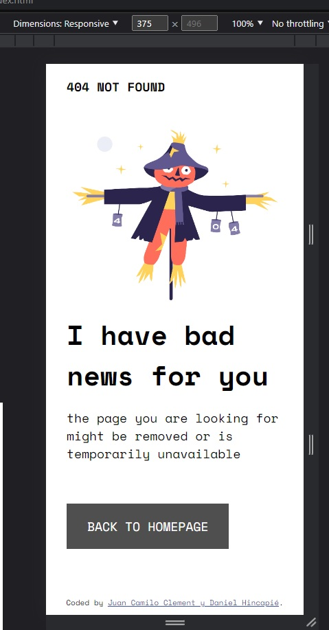
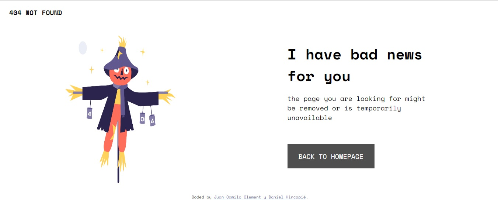

# Make It Real - Challenge 404 Not Found Page

This is a solution to the challenge 404 Not Found Page project of the Make It Real course.

## Table of contents

- [Overview](#overview)
  - [The challenge](#Errorpage404)
  - [Screenshot](#screenshot)
- [My process](#my-process)
  - [Built with](#built-with)
  - [What I learned](#what-i-learned)
  - [Continued development](#continued-development)
  - [Useful resources](#useful-resources)
- [Author](#author)
- [Acknowledgments](#acknowledgments)


## Overview

### The challenge

Users should be able to:

- Build a 404 error page.
- Apply Mobile First approach to make the page responsive.

### Screenshot
MOBILE FIRST


LAPTOP



## My process

### Built with

- Semantic HTML5 markup
- CSS custom properties
- Flexbox
- Mobile-first workflow

### What I learned

We learned how to apply font styles using Google Fonts.


```html
<link rel="preconnect" href="https://fonts.googleapis.com">
<link rel="preconnect" href="https://fonts.gstatic.com" crossorigin>
<link href="https://fonts.googleapis.com/css2?family=DM+Sans:wght@400;500;700&family=Fraunces:opsz@9..144&family=Inter:wght@300;500&family=Libre+Baskerville:ital,wght@0,400;0,700;1,400&family=Montserrat:ital,wght@0,100;0,200;0,300;0,400;0,500;0,600;0,700;0,800;0,900;1,100;1,200;1,300;1,400;1,500;1,600;1,700;1,800;1,900&family=Quicksand:wght@300;400;500;600;700&family=Roboto+Mono:ital,wght@0,100;0,200;0,300;0,400;0,500;0,600;0,700;1,100;1,200;1,300;1,400;1,500;1,600;1,700&family=Space+Mono:wght@400;700&family=Special+Elite&display=swap" rel="stylesheet">
```

We learned how to use flexbox to change the orientation of containers.

```css
.main-container {
    display: flex;
    flex-direction: column;
    margin: 30px;
}
```


### Continued development


The topics where we encountered the most difficulties were:

- Flexbox: Although we used it for container positioning, we found it challenging to use justification effectively.

- Image handling: We struggled with controlling the image's shape when resizing for different devices.

### Useful resources

- [resource 1](https://css-tricks.com/snippets/css/a-guide-to-flexbox/) - 
This page helped us discover some flexbox resources.

## Author

- Website - [Juan Camilo Clement y Daniel Hincapié](git@github.com:danielhincapievargas/challenge-404-not-found-page.git)

